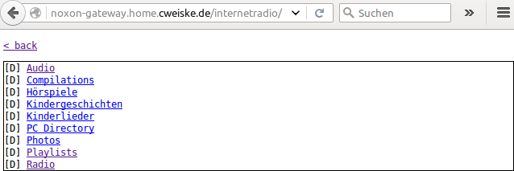

********************
Noxon iRadio gateway
********************
Push your own content onto `Noxon iRadio`__ devices:
RSS feeds, text files and MediaTomb server structures.

This tool makes it possible to push own data into the menu
entries "Internet Radio", "Podcasts" and "My Noxon" without relying
on the official Terratec servers.

__ http://www.noxonradio.de/

.. contents::

========
Features
========
- Customize the Noxon iRadio menus "Internet Radio", "Podcasts" and "My Noxon"
- Show Mediatomb UPnP server content in "Internet Radio", so that you
  don't have to restart your iRadio because it does not find the UPnP server
  after a day of standby
- Display text files and run shell scripts from the menu (home automation)
- Podcast RSS feed support
- Discoverable with your web browser
- Transcoding of non-mp3 file types to ``.mp3`` that iRadios can play
- Single file mode for children that want to listen to a single story
  before sleeping
- Paging results with ``?startitems=1&enditems=10`` GET parameters

RSS feed support
================
Simpy write a podcast's mp3 RSS feed URL into a  ``.url`` file in
the ``var/`` directory structure, and your radio will show you a
folder with all episodes.
Enter an episode to play it.

The Noxon iRadios do only allow a single HTTP redirect when they access a URL
to play, but many podcast feeds send you for tracking purposes through 3 or
more redirects until you reach the final mp3 URL.

noxon-gateway resolves the redirections for the iRadio, so that this will
not be a problem.

Creating an RSS feed
--------------------
You have to know the URL to the podcast's mp3 RSS feed, e.g.
``http://cast.example.org/news.rss``.

Create a file ``Cast News.url`` in ``var/podcasts/`` and write the RSS URL
into it.
That's all.

When accessing the "Podcasts" menu from your noxon iRadio, you'll see a
directory ``Cast News`` that contains all podcast episodes.

Single file mode
================
Your kid only wants to listen to this one single story before sleeping.
You start it, set the 15 minute sleep timer and leave the room.

After 15 minutes the child comes out and complains that the radio switched
off within the second story and it wants to hear it to the end.

To get around such issues, you can enable "single file directories"
for certain folders.

Each folder with audio files within this configured paths have a special
directory "Einzeln" (single), which have separate folders for each audio
file. Each of this separate folders only have the single audio file in them.

When playing this file, the iRadio will stop playing after the one file
is over.

Supported radios
================
This is the list of iRadios known to work with ``noxon-gateway``:

- `Noxon iRadio`__ (original white version)
- `Noxon iRadio cube`__

Others should work.
If you know of unlisted radios that do work with this tool, please tell me.

__ http://ftp.noxonradio.de/index.php?dir=NOXON%2FNOXON_iRadio%2F
__ http://ftp.noxonradio.de/index.php?dir=NOXON%2FNOXON_iRadio_Cube%2F

Web browser support
===================
You can discover the noxon-gateway contents with your web browser.
Point your browser to the gateway's domain and start browsing:

This works because the XML files delivered by noxon-gateway contain the
link to an XSLT__ file that converts the XML structure to HTML that
browsers understand.

Works at least with Firefox 42 and Chromium 45.

__ http://www.w3.org/TR/xslt

===================================
Customizing the directory structure
===================================
The ``var/`` directory contains three directories you can fill with
your own content.

================ ==================
Menu item        ``var/`` Directory
================ ==================
Internet Radio   ``internetradio``
Podcasts         ``podcasts``
My Noxon         ``mynoxon``
================ ==================

You can put folders and files into this directories.

The ``internetradio`` directory is hard-coded to display the contents
of a MediaTomb UPnP server.
You can remove the check in ``index.php#handleRequest()`` if you do not
want this.

File types
==========
Directory
  A directory is browsable by your Noxon radio
``.txt`` file
  Text files are rendered as un-actionable lists, one list item per line.

  Empty lines get removed, consecutive spaces get collapsed.
``.url`` file
  Podcast feed URL file.

  Simply contains the URL to the podcast's MP3 RSS feed.
executable file
  Script is shown as directory and gets executed when navigating
  into it.
  Output is shown as it is for ``.txt`` files.

  I use it to control my house's heating system from the radio.
``*.auto*`` (executable)
  Script gets executed when browsing the folder.
  The output is integrated into the directory listing with the same
  rules as for ``.txt`` files.

  You can use this to show the current time within the directory listing.

File extensions get removed for display purposes.

Sorting
=======
Files and directory are sorted alphabetically and get listed
in this order.

You can prefix your files and directories with ``[0-9]+_``,
which lets you influence sorting and gets removed in the
listings.

Consider the following files::

    01_temp.auto.sh
    02_warmer.sh
    03_colder.sh

Would render as::

    Temperature: 23°C
    warmer
    colder

(given that ``01_temp.auto.sh`` outputs the temperature string)

=====
Setup
=====

Hosts
=====
The following hosts must point to your server and be handled
by this tool::

    radio567.vtuner.com
    radio5672.vtuner.com
    gatekeeper.my-noxon.net

Configure this in your router or the DNS server your iRadio devices use.

MediaTomb
=========
To be able to browse a MediaTomb server, copy ``data/config.php.dist`` to
``data/config.php`` and fill it with mediatomb web interface credentials.

You also have to install the `Services_Mediatomb`__ library via `PEAR`__::

    $ pear channel-discover zustellzentrum.cweiske.de
    $ pear install zz/services_mediatomb-alpha

__ http://zustellzentrum.cweiske.de/index.php?package=Services_MediaTomb
__ http://pear.php.net/

Transcoding
===========
If you have non-mp3 files in your audio collection, install `ffmpeg`__
on the noxon-gateway server.
Transcoding will start automatically when the player accesses a file
that is not in ``audio/mpeg`` format.

__ http://ffmpeg.org/

===================
About noxon-gateway
===================

Homepage
========
The source code is available at http://git.cweiske.de/noxon-gateway.git/
and mirrored at https://github.com/cweiske/noxon-gateway.

License
=======
This application is available under the `AGPL v3`__ or later.

__ http://www.gnu.org/licenses/agpl.html

Author
======
Written by `Christian Weiske`__, cweiske@cweiske.de

__ http://cweiske.de/
